# Static Web Hosting Project on AWS using AWS S3

First I add the bucket in my AWS S3 with this configuration :

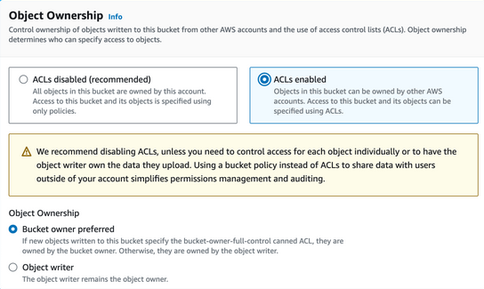

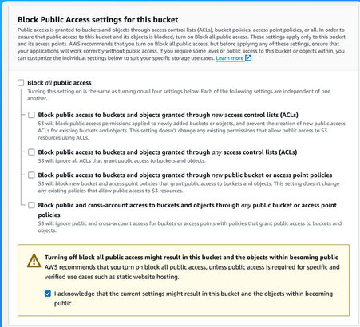

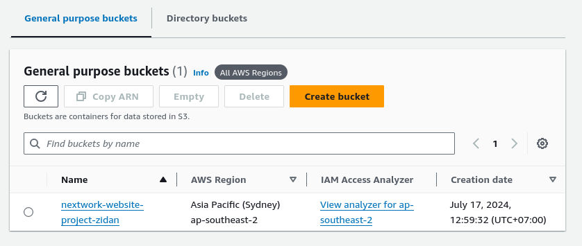 

I set `ACLs enabled` so I can have full access of the permission on files.

I also uncheck the `Block Public Access settings for this bucket` so public can have access to my file.

And then I upload the file that are needed for the page. 

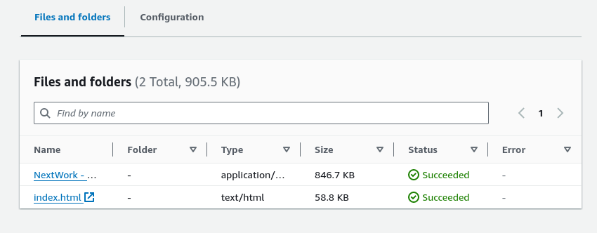 

Index.html is the website, and the zip files containe all the resources that are related to the website. 

Then I setup the index.html so it's can be accessed by anyone who click the link.

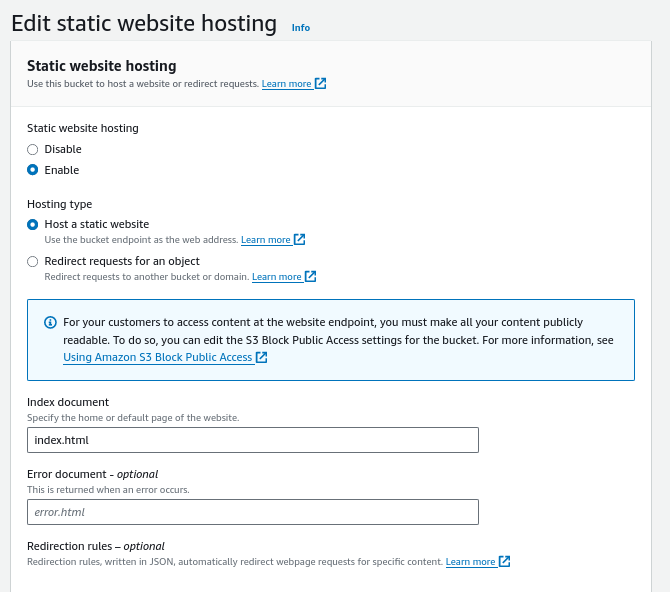 

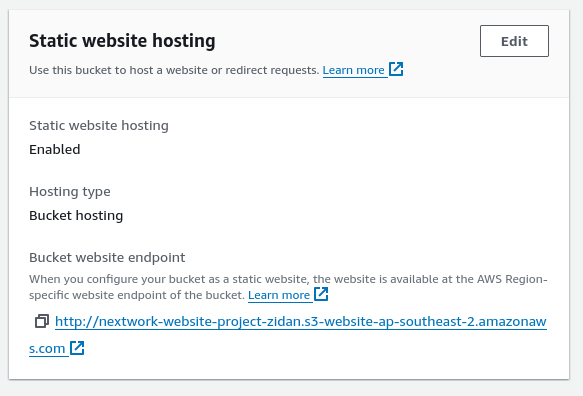 

But, when we click the page. it's give this output:

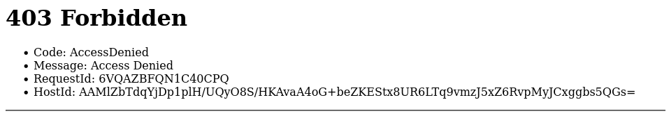 

This error because I didn't set the right permission for my file.

So now this is the way to fix it. Click the file, go to `permission` tab and then set this configuration:

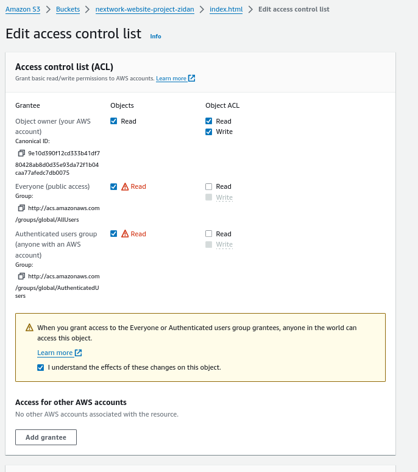

After that, the website is accessible?:

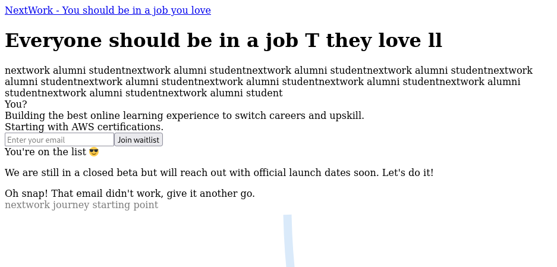

Well, not quite. So, my problem is I input the zip files, not the folder and didn't set the permission on the folder.

So, to set the entire folder to right permission, I block the folder, and go to `Actions` and then `Make Public using ACLs`.

This is the output when I success set the folder to public:

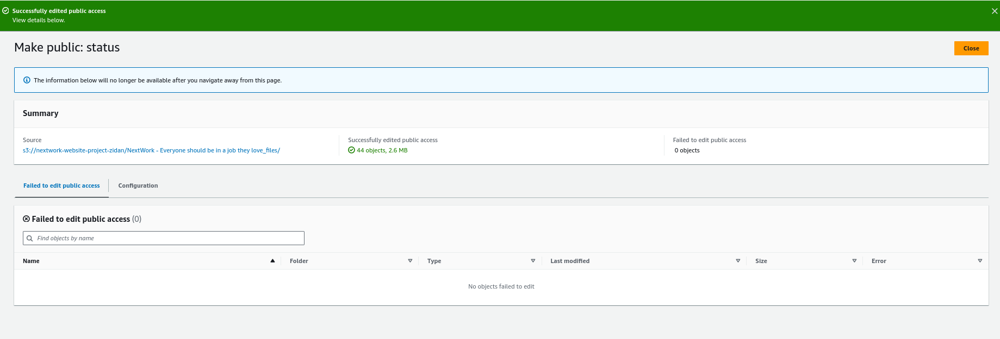

Now let's try to access the website again if it's working:

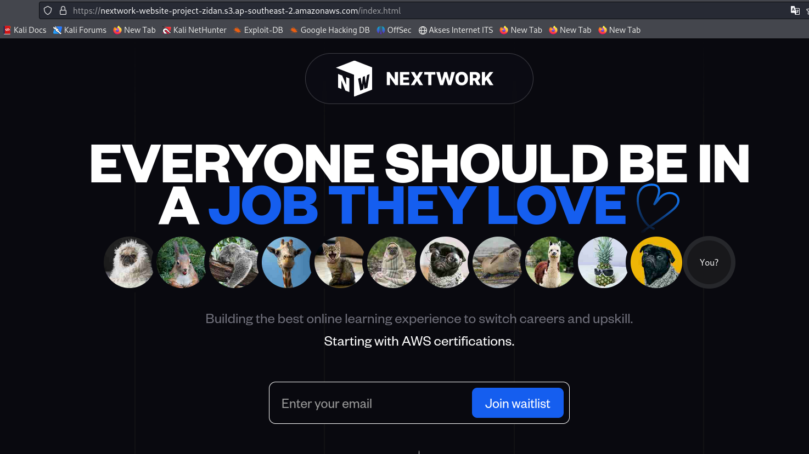